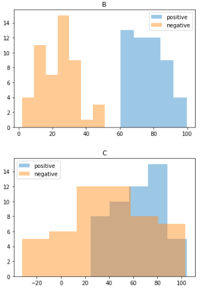
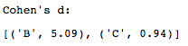
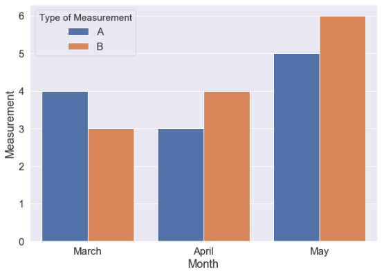

## Helpful Plotting and Pandas Patterns

The following are mainly notes to myself about a few things to do upon receiving a dataset.

Some basic Python imports:

```
import pandas as pd
import numpy as np
import matplotlib.pyplot as plt
import seaborn as sns
```


### Binary-Target Histograms and Cohen's d

If you have a binary target variable, it's often illustrative to plot a histogram of each feature showing two populations: the feature's values where the target is positive, and its values where the target is negative.  Other conditions may be placed on membership in either group to exclude outliers if desired.

```
# made-up data for a dataframe
d = {'target': [0] * 50 + [1] * 50,
     'B': list(np.random.normal(25, 10, 50)) + list(np.random.normal(75, 10, 50)),
     'C': list(np.random.normal(40, 30, 50)) + list(np.random.normal(66, 20, 50))}
df = pd.DataFrame(d)
yes = df[(df['target'] == 1) & (df['B'] < 100)]
no = df[(df['target'] == 0) & (df['B'] < 100)]
cols = list(df.columns)
# we could plot the target column, but it would just show us the proportion of 0's and 1's
cols.remove('target')
for name in cols:
    a = yes[name].values
    b = no[name].values
    sns.distplot(a, label = 'positive', kde = False, rug = False)
    sns.distplot(b, label = 'negative', kde = False, rug = False)
    plt.title(name)
    plt.legend()
    plt.show()
```



The visible separation in pairs of distributions can be quantified by Cohen's d, a standardized difference (dividing by pooled standard deviation) between the means of the positive and negative populations.  Often this is a way to get a preview of the feature importances of decision-tree-based classifiers, which tend to have similar ordering to Cohen's d. This makes sense as higher Cohen's d indicates higher effect size (i.e more separation between positive and negative distributions), which should give the decision tree greater ability to identify which distribution (positive or negative) a particular observation came from.

```
cd = []
nn = len(no)
ny = len(yes)
for name in cols:
    a = yes[name].values
    b = no[name].values
    cd.append((name, round((abs(np.mean(a) - np.mean(b)) /
              np.sqrt(((ny - 1)*np.std(a)**2 + (nn - 1)*np.std(b)**2) / (nn + ny - 2))),2)))
print("Cohen's d:")
sorted(cd, key = lambda x: x[1], reverse = True)
```




### Side-by-Side Bar Chart (Seaborn)

Here's a quick side-by-side bar chart to show more than one vertical value (all on the same scale) for each category on the horizontal axis - in case you would like to see various versions of a metric for each group or point in time.

```
# nonsense example data:
d = {'Month': ['March', 'March', 'April', 'April', 'May', 'May'],
                       'Measurement': [4, 3, 3, 4, 5, 6],
                       'Type of Measurement': ['A', 'B', 'A', 'B', 'A', 'B']}
to_chart = pd.DataFrame(d)
# the line below is convenient to adjust depending on scale and look of plot
sns.set(font_scale = 1.5)
fig, ax = plt.subplots(figsize = (10, 7))
# hue is the argument to know, indicates the two versions of each month's data to show
sns.barplot(x = 'Month', y = 'Measurement', hue = 'Type of Measurement', data = to_chart)
plt.show()
```




### Null Values and Duplicates

This seems to be the fastest way to check for any null values present in a dataframe: `df.isnull().values.any()`.

Here are two quick ways to check for duplicates. Returns False if duplicate rows (same values in specified `subset` columns, or same in all columns if none specified) are found, and True if no duplicates.

```
# otherwise useful `keep` argument, not needed here, allows control over which copies of a particular row are kept/dropped
np.sum(df.duplicated(subset = ['A', 'B', 'C'])) == 0
df.equals(pd.DataFrame.drop_duplicates(df, subset = ['A', 'B', 'C']))
```

The `.duplicated` method will also return a useful Pandas series of True at duplicate locations and False elsewhere.  If you do drop some duplicates (use `inplace = True`), and the index isn't meaningful, you could do `df.reset_index(drop=True)` to keep the index numbers what you would assume (i.e. so it won't break when you happen to use `.loc` instead of `.iloc` much later).


### Other Initial Checks

Look at `df.info()`, `df.describe()`, `df.shape`, `df.head(N)` (where N is a judgement-call number of rows needed to make sense of the dataframe) and `df.iloc[n:m]` (where `n:m` is a slice somewhere a random percentage of the way to the end of the rows as the beginning and end may have idiosyncrasies).  Look at `set(df.column)` and `len(set(df.column))` for each column for unique values.


### `.groupby` (along with `.merge`) for SQL Operations (dplyr/reshape2 in R)

Start with the likes of `df[['A', 'B', 'C']].groupby('B').count().sum()`.  Tack on `.sort_values('A', ascending = False)` or replace `.count().sum()` with `.agg({'A': lambda_function_1, 'C': lambda_function_2})` (where the lambda functions, defined elsewhere, pick out qualities of a group, e.g. average length of strings).  Instead of columns, specify rows with conditions `df[(df.A > 0) & (df.C > 100)].groupby('B').count().sum()`.

To take this further, iterate through a grouped dataframe:

```
for name, group in grouped_df:
    more_complex_function_1(group)
    more_complex_function_2(name)
```

Use `.merge` suffixes to keep track of columns when joining a table to itself or a similar table (such as when chaining together periods to assess transitions):

```
merged = table_1[table_1.month == 'January'].merge(table_2[table_2.month == 'February'], on = 'ID', suffixes = ('L', 'R'))
# now you can make a column of ratios or percent changes from January to February, i.e. merged.balanceR / merged.balanceL - 1
```


### Apply and Assign

Here's the best way I've found to add derived columns to a dataframe. It's nice to see the lambda function separately. Adding if-else logic is often useful:

```
# Here 'A' and 'B' are columns in df:
fn = lambda row: row['A'] / row['B'] if row['B'] != 0 else 0
df_expanded = df.assign(derived_column = df.apply(fn, axis = 1).values
```
